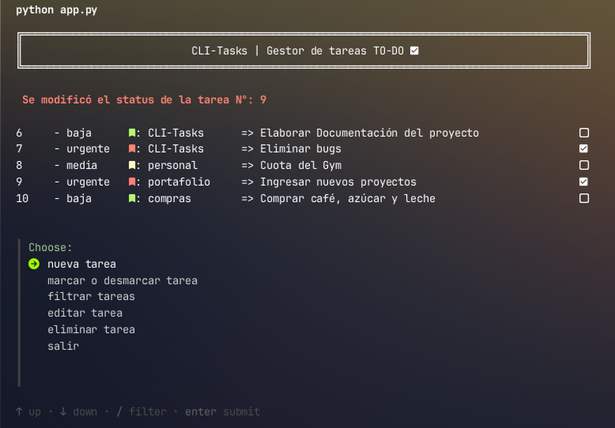

<div align="center">
    
    <h1>CLI-Tasks </h1>
    
    <p>Aplicación de gestión de tareas (to-do) en la terminal, escrita en Python</p>
    <div>
         
        
    </div>
</div>
<br>

CLI-Tasks ofrece las funcionalidades básicas de un gestor o lista de tareas
común pero con la ligereza y comodidad de ser una aplicación de terminal. 

Puedes revisar tus tareas pendientes mientras trabajas en la cónsola


### Funcionalidades
* Crear nuevas tareas, puedes asugnar una prioridad [baja - media - urgente]
y otra secundaria para identificar y filtrar tus tareas.
* Marcar como completadas y desmarcar para dejarlas pendientes.
* Editar tus tareas, puedes cambiar etiquetas y contenido.
* Aplicar filtros por etiquetas
* Eliminar las tareas que ya no sean necesarias


### Requerimientos
Es necesario una versión de python 3.11 o mayor, al igual que el módulo
pydantic
```bash
pip install pydantic
```
También, debes tener instalado en tu sistema `gum cli`, 
una excelente herramienta para elaborar buenos scripts.
Visíta su repositorio y dales una merecida estrella.
<div>
    <a href="https://github.com/charmbracelet/gum">gum cli</a>
</div>

```bash
# macOS or Linux
brew install gum

# Arch Linux (btw)
pacman -S gum

# Nix
nix-env -iA nixpkgs.gum

# Windows (via WinGet or Scoop)
winget install charmbracelet.gum
scoop install charm-gum
```
Es recomendable que cuentes con una fuente Nerd Fonts y que tu terminal
soporte caracteres especiales para una mejor visualización.

### Instalación 
Para instalarlo, sólo debes descargar o clonar el repositorio y en la 
ruta que hayas elegido en tu equipo y ejecutar el script:
```bash
python app.py
```
La base de datos se generará en la ruta que especifiques en éste archivo


### Base de datos
La aplicación trabaja con una base de datos SQLite, la cual se debe
configurar en el archivo `database.py`, colocando la ruta donde deseas
alojarla
```python
db_path = "/ruta_personalizada/tu_base_de_datsos.db"
```

### Contribuciones
Estoy muy agradecido de cualquier aporte y nuevas ideas para implementar
el la aplicación. No dudes en hacermelo saber !!

### Licencia
Este proyecto esta bajo la [Licencia MIT](./resources/LICENSE.md)

### Autor
Desarrollado por:
<br><br>
<div align="center">
    <div style="display: flex; flex-direction: column; justify-content: center; align-items: center;">
        
        <p>Gustavo E. Colmenares.-</p>
        <p>GUScode</p>
    </div>
    <br>
    <div style="display: flex; justify-content: center; align-items: center;">
        <a href="https://www.linkedin.com/in/gustavo-colmenares-guscode/" target="_blank" style="padding-inline: 15px">
            
            <span style="display: block; font-size: 10px; color: white;">linkedin</span>
        </a>
        <a href="https://gustavo9481.github.io/Portafolio/" target="_blank" style="padding-inline: 15px">
            
            <span style="display: block; font-size: 10px; color: white;">portafolio</span>
        </a>
        <a href="https://www.instagram.com/guscode.apps/" target="_blank" style="padding-inline: 15px">
            
            <span style="display: block; font-size: 10px; color: white;">instagram</span>
        </a> 
    </div>
    <br>
    <p style="font-size: 13px;">Todos los derechos reservados Ⓒ</p>
</div>
